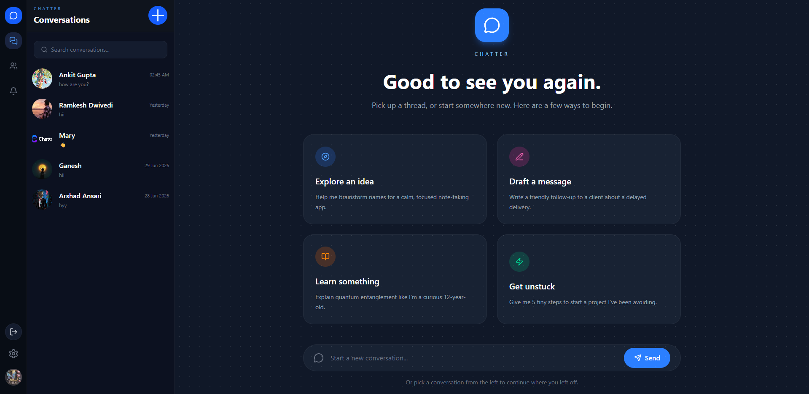
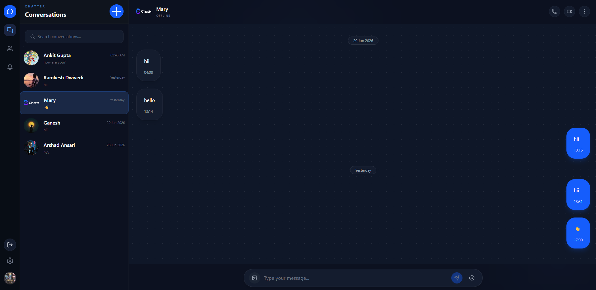
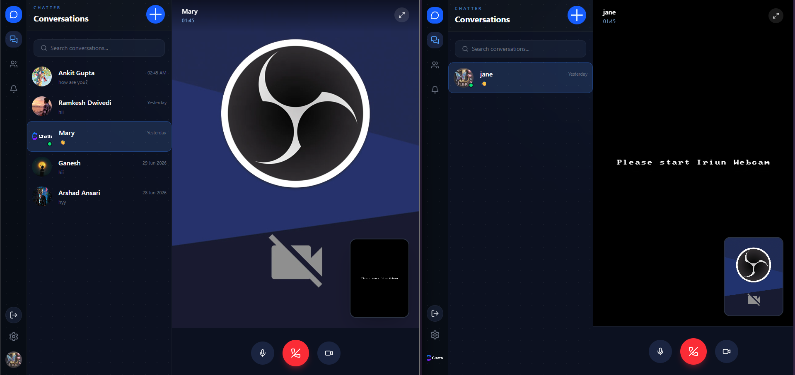

# Chatter 💬

A full-stack real-time chat application with 1-on-1 video and audio calling, built using the MERN stack and WebRTC.



---

## Features

- 🔐 **Authentication** — Secure signup/login with JWT and httpOnly cookies
- 💬 **Real-time messaging** — Instant messaging powered by Socket.io
- 📹 **Video & Audio Calls** — Peer-to-peer calling using raw WebRTC APIs (no third-party SDK)
- 🟢 **Online presence** — See who's online in real time
- 🖼️ **Image sharing** — Send images in chat
- 😀 **Emoji picker** — Built-in emoji selection tray
- 👤 **Profile picture** — Update profile pic with real-time sync across all sessions
- 🔍 **Find users by email** — Start a new conversation by searching a user's email
- 🛡️ **Security** — Protected with Arcjet (rate limiting, bot detection, and SQL injection/attack shielding)

---

## Tech Stack

### Frontend
| Technology | Purpose |
|---|---|
| React 19 | UI framework |
| Vite | Build tool |
| Tailwind CSS v4 | Styling |
| Zustand | State management |
| Socket.io Client | Real-time communication |
| WebRTC | Peer-to-peer video/audio |
| Lucide React | Icons |
| React Hot Toast | Notifications |
| Emoji Picker React | Emoji selection |
| Axios | HTTP client |

### Backend
| Technology | Purpose |
|---|---|
| Node.js | Runtime |
| Express.js | Server framework |
| MongoDB + Mongoose | Database |
| Socket.io | WebSocket server |
| JWT | Authentication |
| bcryptjs | Password hashing |
| Cloudinary | Profile image storage |
| Arcjet | Security — rate limiting, bot detection, attack protection |

---

## Project Structure

```
chatter/
├── frontend/
│   ├── src/
│   │   ├── components/       # Reusable UI components
│   │   ├── pages/            # Page-level components
│   │   ├── store/            # Zustand state stores
│   │   ├── services/         # WebRTC peer service
│   │   ├── lib/              # Axios instance and utilities
│   │   └── App.jsx
│   └── package.json
│
├── backend/
│   ├── src/
│   │   ├── controllers/      # Route handlers
│   │   ├── models/           # Mongoose models
│   │   ├── routes/           # Express routes
│   │   ├── middleware/       # Auth middleware
│   │   └── lib/              # Socket.io, DB, env config
│   └── package.json
│
└── README.md
```

---

## Getting Started

### Prerequisites

Make sure you have the following installed:
- [Node.js](https://nodejs.org/) v18 or above
- [MongoDB](https://www.mongodb.com/) (local or Atlas)
- [Git](https://git-scm.com/)

---

### Installation

**1. Clone the repository**

```bash
git clone https://github.com/Arshad101001/Chatter.git
cd chatter
```

**2. Setup environment variables**

Create a `.env` file inside the `backend/` folder:

```env
PORT=3000
MONGODB_URI=your_mongodb_connection_string
JWT_SECRET=your_jwt_secret_key
CLIENT_URL=http://localhost:5173

CLOUDINARY_CLOUD_NAME=your_cloudinary_cloud_name
CLOUDINARY_API_KEY=your_cloudinary_api_key
CLOUDINARY_API_SECRET=your_cloudinary_api_secret

ARCJET_KEY = your_arcjet_key
ARCJET_ENV = development / production
```

**3. Install backend dependencies**

```bash
cd backend
npm install
```

**4. Install frontend dependencies**

```bash
cd ../frontend
npm install
```

**5. Run the development servers**

Open two terminal windows:

Terminal 1 — Backend:
```bash
cd backend
npm run dev
```

Terminal 2 — Frontend:
```bash
cd frontend
npm run dev
```

**6. Open the app**

```
http://localhost:5173
```

---

## Security — Arcjet
 
Chatter uses [Arcjet](https://arcjet.com) to protect the backend API with three layers of security:
 
| Rule | Mode | Details |
|---|---|---|
| **Shield** | LIVE | Blocks common web attacks — SQL injection, XSS, and more |
| **Bot Detection** | LIVE | Blocks malicious bots, allows search engine crawlers |
| **Sliding Window Rate Limit** | LIVE | Max 100 requests per 60 seconds per client |
 
---
## How WebRTC Calling Works

Chatter implements video and audio calling using **raw browser WebRTC APIs** without any abstraction library:

```
Caller                    Socket.io Server              Receiver
  |                             |                          |
  | getUserMedia()              |                          |
  | addTrack(stream)            |                          |
  | createOffer()               |                          |
  |--- "user:call" + offer ---->|                          |
  |                             |---- "incoming:call" ---->|
  |                             |                          |
  |                             |       getAnswer(offer)   |
  |                             |<--- "call:accepted" -----|
  |                             |                          |
  | setRemoteDescription(ans)   |                          |
  |                             |                          |
  |<==== ICE exchange + direct P2P media flow ============>|
```

Socket.io is used **only for signaling** (exchanging offer/answer/ICE candidates). Once the connection is established, all video and audio flows **directly peer-to-peer** — the server is completely out of the picture.

---

## Screenshots

| Conversations | Chat Open | Video Call |
|---|---|---|
|  |  |  |

---

## Future Updates

- [ ] 🔒 End-to-end encryption for messages
- [ ] 👥 Group chat support
- [ ] 📞 Group video/audio calls
- [ ] ✅ Message read receipts (double tick)
- [ ] 🗑️ Delete and edit messages
- [ ] 💬 Message reactions (emoji reactions)
- [ ] 📌 Pin messages
- [ ] 🔇 Mute conversations
- [ ] 📁 File sharing (PDF, docs)
- [ ] 🌐 Deploy to production

---

## Contributing

Pull requests are welcome. For major changes please open an issue first to discuss what you would like to change.

---

## Author

**Arshad Ansari**
- GitHub: [Arshad101001](https://github.com/Arshad101001)
- LinkedIn: [arshad101001](https://linkedin.com/in/arshad101001/)

---

## License

[MIT](https://choosealicense.com/licenses/mit/)